# Diagrams (for reviewers)

Module-by-module visuals for the unified Postgres design.

---

## 1. System Overview

Flow summary: client and staff-facing apps call the Main API for core product actions. External systems (Chatwoot and payment provider) send webhooks into handlers, and both synchronous API paths and async workers persist state in Postgres. AI review runs are triggered by API or jobs and their outcomes are written back through the backend.

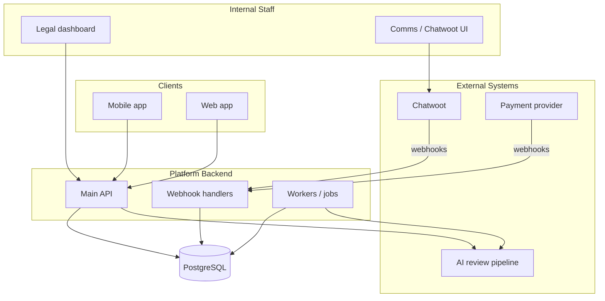

---

## 2. User Account + RBAC Module

Flow summary: tenants are the isolation root, users are created under a tenant, auth identities are attached per user, and role assignments are written in `user_roles`. Permission checks resolve from `user_roles` -> `roles` -> `role_permissions` -> `permissions` for authorization decisions in the app.

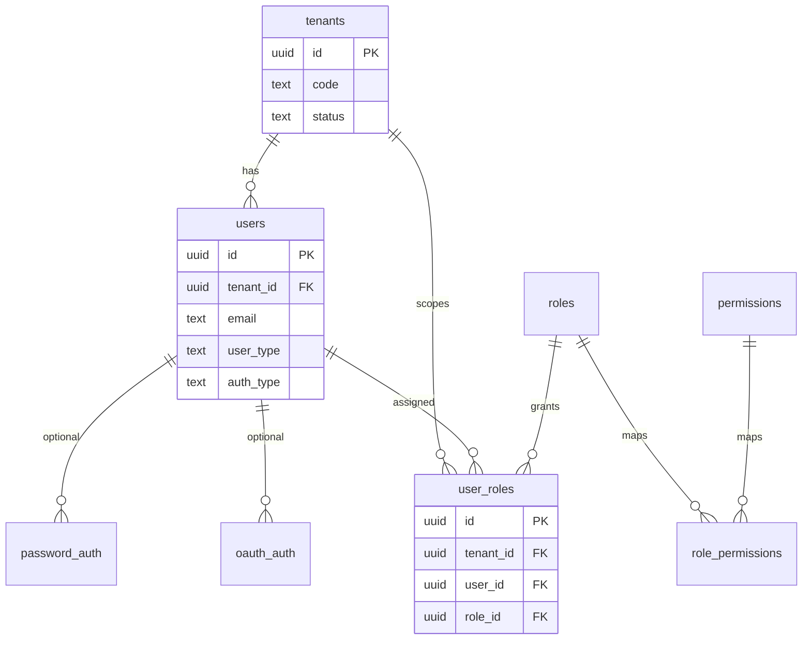

---

## 3. Service + Documents Module

`dtv_service_applications` is separated from `service_applications` on purpose:

- `service_applications` stays generic for all service types.
- DTV-only fields (for example travel/arrival-specific fields) do not pollute the base table for every other service.
- New service-specific fields can be added without risky schema bloat on the shared table.
- Querying remains clean: common queries hit `service_applications`; DTV flows join `dtv_service_applications` only when needed.

Flow summary: service definitions are configured through `services`, `service_versions`, `documents`, and `service_documents`. A user starts work through `service_applications`, then uploads files via `document_submissions` and `document_files`, while process checkpoints are appended in `application_steps`.

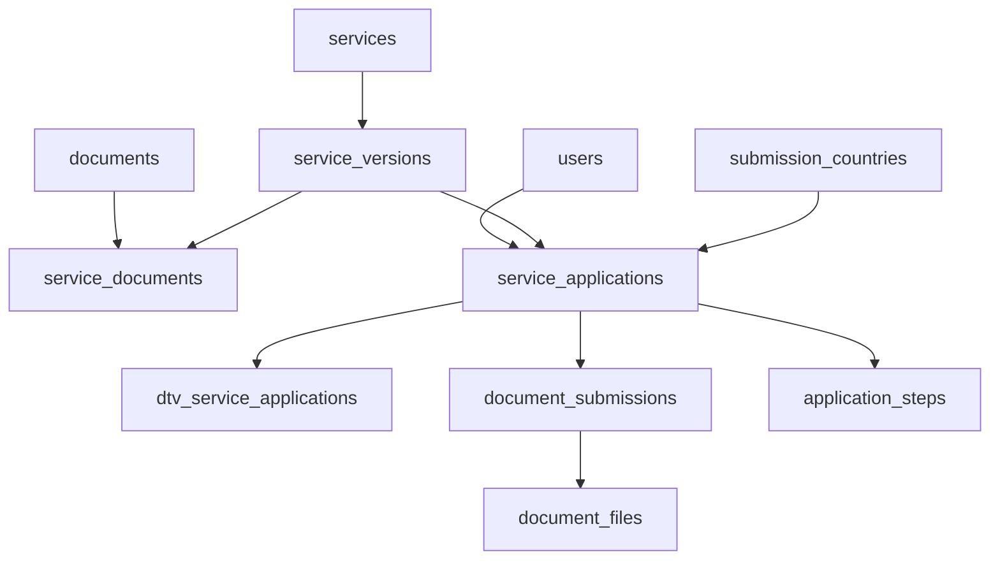

---

## 4. AI Document Review Module

Flow summary: when files are submitted for an application, a new AI review run is appended in `ai_doc_reviews`. Reviewed files for that run are linked in `ai_doc_review_run_files`, allowing many files per run and full retry history without overwriting prior outcomes.

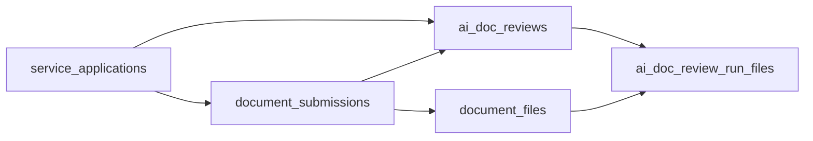

---

## 5. Conversation Module

Flow summary: provider webhooks update the `conversations` snapshot, staff mapping is resolved through `staff_provider_agents`, and conversations can be linked to one or more service applications through `conversation_service_applications`. CRM qualifiers stay current in `conversation_crm_profiles` and every change is appended to `conversation_crm_profile_history`.

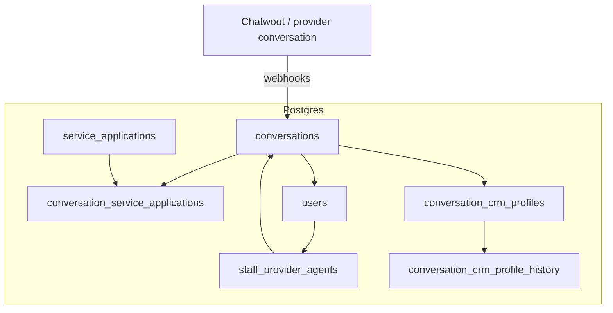

---

## 6. Audit Log Module

Flow summary: each domain module emits audit entries into `audit_logs` for important actions. The audit stream is append-only and cross-module, so reviewers and support teams can trace what happened, who performed it, and when it happened using one canonical log path.

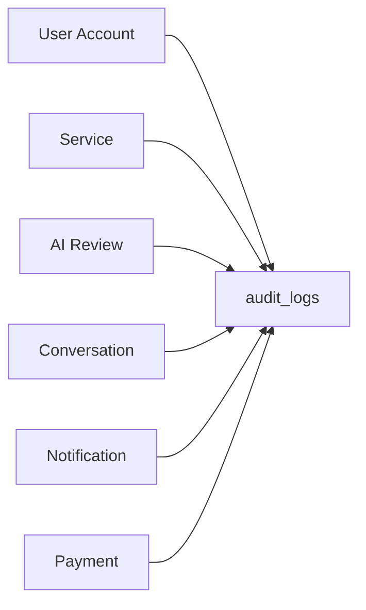

---

## 7. Notification Module

Flow summary: domain events create notification intents in `notifications`, channel targets and user preferences shape delivery behavior, and each send/retry attempt is recorded in `notification_deliveries` for operational visibility and retry safety.

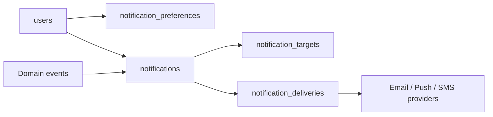

---

## 8. Payment Module

Flow summary: payment intent starts at `payment_orders`, execution attempts are tracked in `payment_attempts`, provider webhooks are ingested in `payment_provider_events`, and immutable money movement is appended to `payment_transactions`. Refund lifecycle is tracked in `payment_refunds` and also reflected in ledger rows.

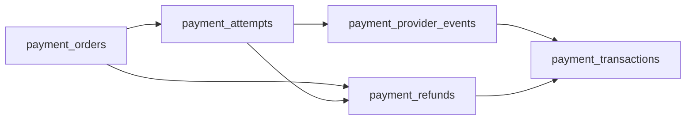

**Operational sequence (happy path):**

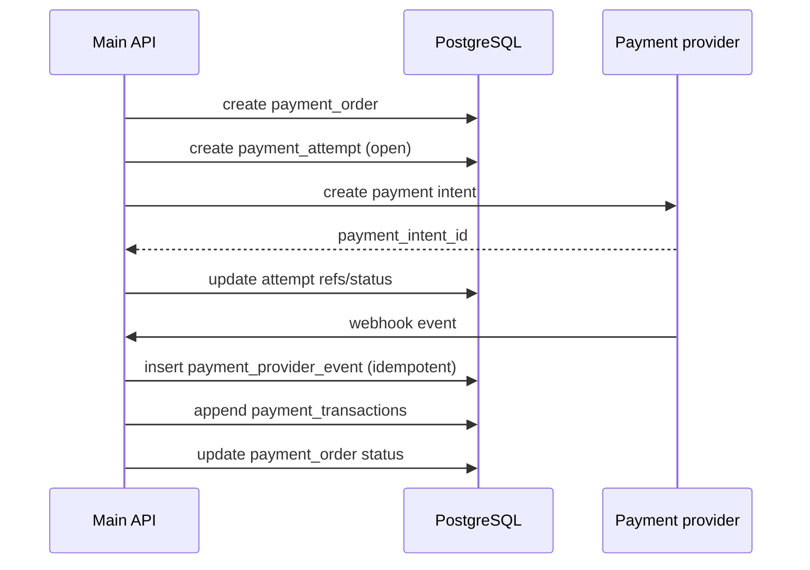

---

## 9. Agents + MCP Future Module

Flow summary: staff interacts with agents from the UI, the bridge enforces tenant and RBAC context, then routes domain reads/writes through Main API or API Gateway and routes tool calls to Issa Compass MCP (and optional third-party MCP servers). Rollout starts read-first, then moves to guarded writes after validation.

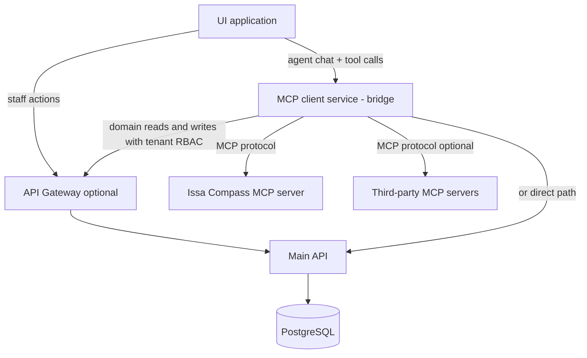

**Agent rollout:**

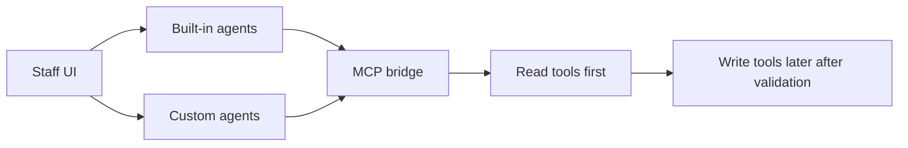
