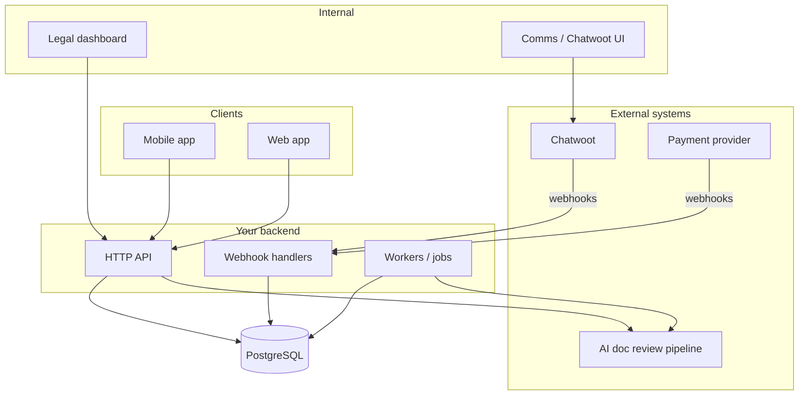
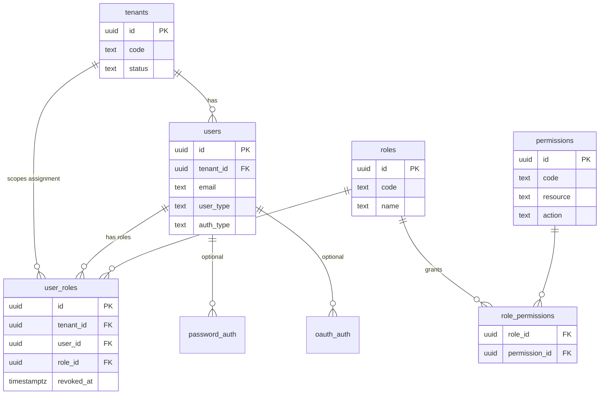
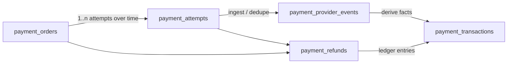
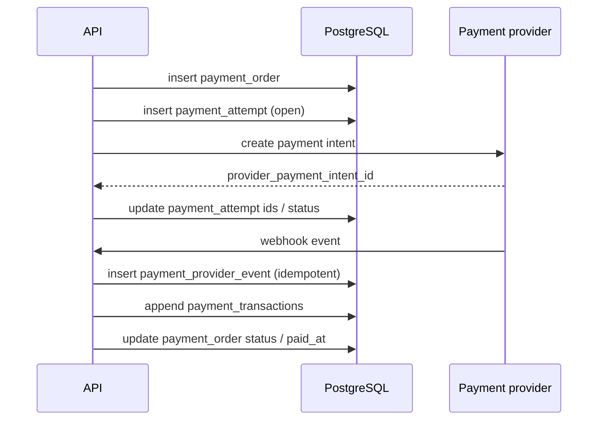
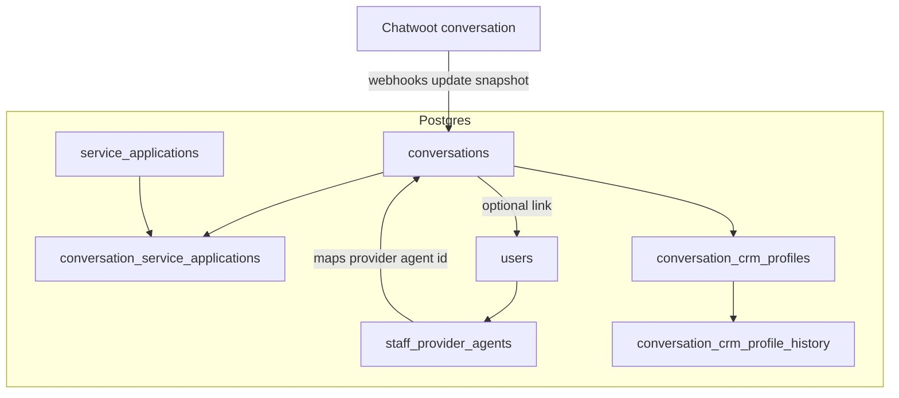
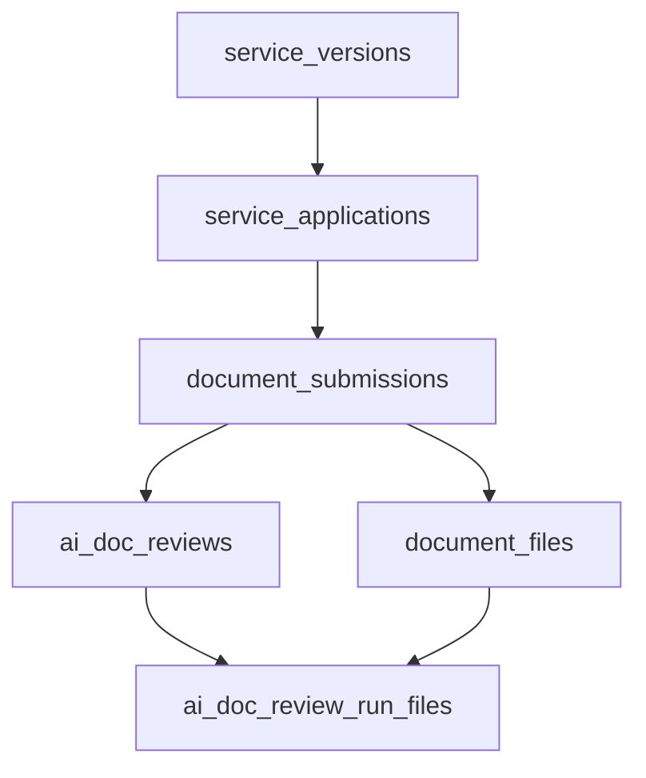
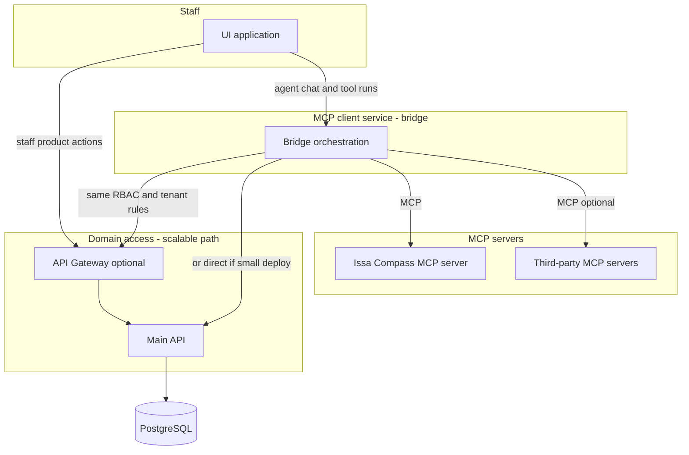
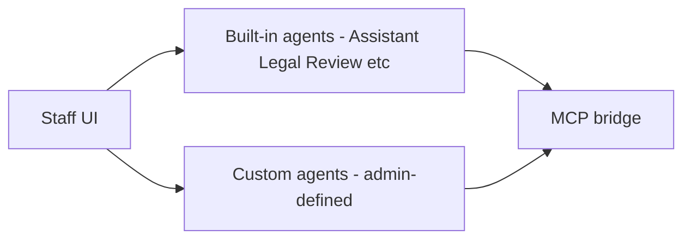

# Diagrams (for reviewers)

Short visuals for the unified Postgres design. GitHub (and many editors) render Mermaid in preview.

---

## 1. High-level: who talks to what

Shows the main runtime boundaries: clients and staff use your API; Chatwoot and the payment provider push webhooks; async workers read/write Postgres.

---

## 2. Tenancy + identity + RBAC

`tenants` is the isolation root. Every `users` row belongs to one tenant. Role **assignments** are tenant-scoped: `user_roles` must match that user’s `(id, tenant_id)` (composite FK in `main/user_account.sql`). `roles` / `permissions` stay a global catalog in V1.

---

## 3. Payments: tables and money flow

**Intent** lives on `payment_orders`. **One active charge path** goes through `payment_attempts` (idempotency: do not open a second “in flight” attempt for the same order). **Provider noise** lands in `payment_provider_events`. **Immutable ledger** for money movement is `payment_transactions`. **Refund workflow** is `payment_refunds` (status + provider ids), while ledger rows record the financial outcome.

**Typical sequence** (happy path, simplified):

---

## 4. Conversations: mirror + link to internal work

Chatwoot (or another provider) stays the **message UI source of truth**. Postgres stores a **provider-agnostic snapshot** (`conversations`) plus **CRM profile** tables and **links** to `service_applications` when the same person starts product work. Staff in the provider map to internal users via `staff_provider_agents`.

---

## 5. Core “service work” chain (documents + AI review)

How an application ties to submissions, files, and append-only AI history (names from `main/service.sql` / `main/ai_doc_review.sql`).

---

## 6. Future: staff agents (bridge + Main API / gateway + MCP)

**Goal:** staff chat with **agents** (built-in like Assistant / Legal Review, or **custom** agents admins define) to get answers fast and run **allowed actions** per agent. Nothing bypasses tenancy, RBAC, or audit.

**Flow (conceptual):** UI → **MCP client service (bridge)** → **Main API** and/or **API Gateway** (scalable, normal platform path) → **Postgres**. Same bridge → **MCP protocol** → **Issa Compass MCP server** (first-party tools) and optionally **other third-party MCP servers** (separate allowlists per agent / tenant).

**Agent types (who configures what):**

**V1 schema:** no extra tables required for this roadmap; first cut can lean on `audit_logs` and add `agent_*` tables when product scope is fixed. Detail: `decisions/agents-mcp.md`.

---

## How to use this in the submission

- Point reviewers here from the main write-up (one line in email or README).
- You do not need more than these; extra ER diagrams for every table usually add noise unless the brief asks for full ERD.
