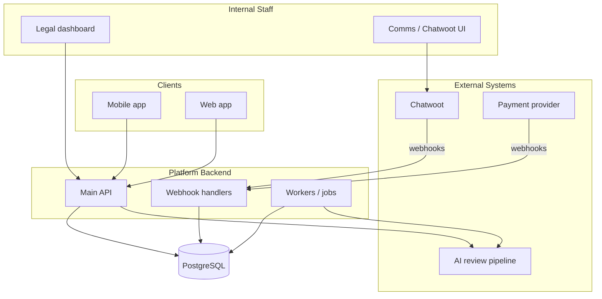
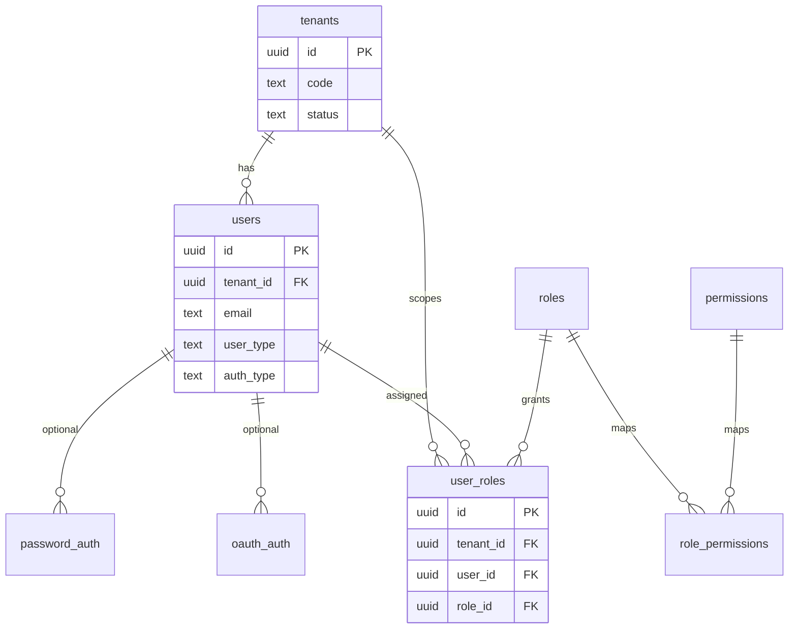
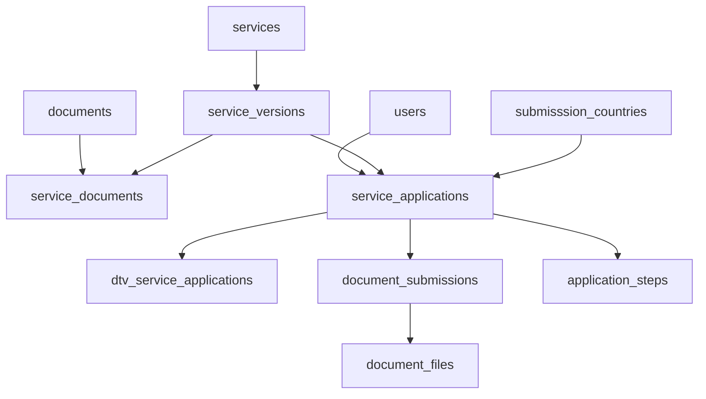
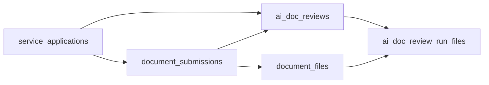
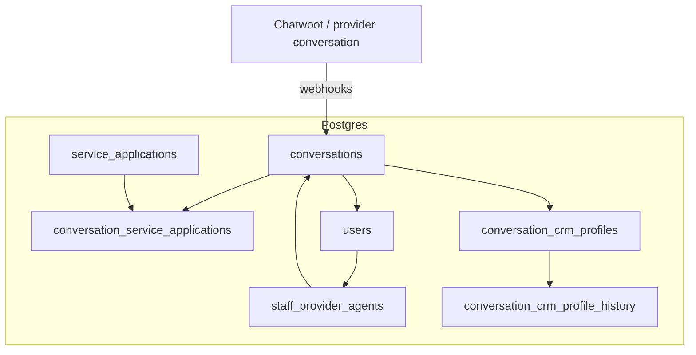
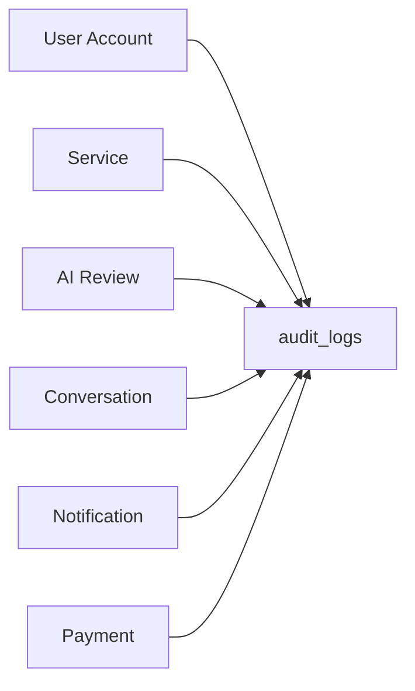
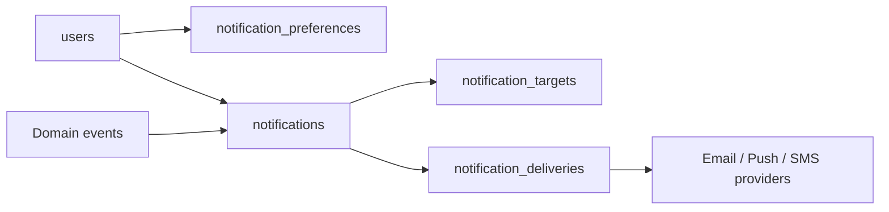
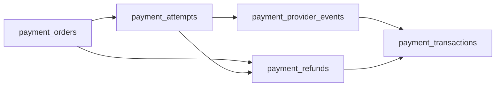
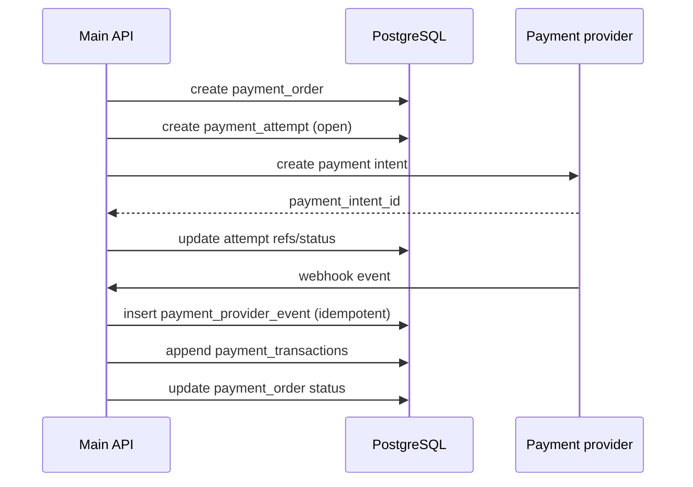
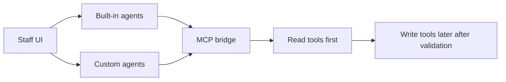

# Diagrams (for reviewers)

Module-by-module visuals for the unified Postgres design.

---

## 1. System Overview



---

## 2. User Account + RBAC Module



---

## 3. Service + Documents Module



---

## 4. AI Document Review Module



---

## 5. Conversation Module



---

## 6. Audit Log Module



---

## 7. Notification Module



---

## 8. Payment Module



**Operational sequence (happy path):**



---

## 9. Agents + MCP Future Module

```mermaid
flowchart TB
  UI[UI application]
  BRIDGE[MCP client service (bridge)]
  GW[API Gateway optional]
  API[Main API]
  PG[(PostgreSQL)]

  MCPIC[Issa Compass MCP server]
  MCP3P[Third-party MCP servers]

  UI -->|staff actions| GW
  UI -->|agent chat + tool calls| BRIDGE
  GW --> API
  BRIDGE -->|domain reads/writes with tenant+RBAC| GW
  BRIDGE -->|or direct path| API
  BRIDGE -->|MCP protocol| MCPIC
  BRIDGE -->|MCP protocol optional| MCP3P
  API --> PG
```

**Agent rollout:**



---

## How to use this in submission

- Link this file from the main write-up.
- Keep this as the primary visual reference; avoid duplicating many extra diagrams unless explicitly requested.
